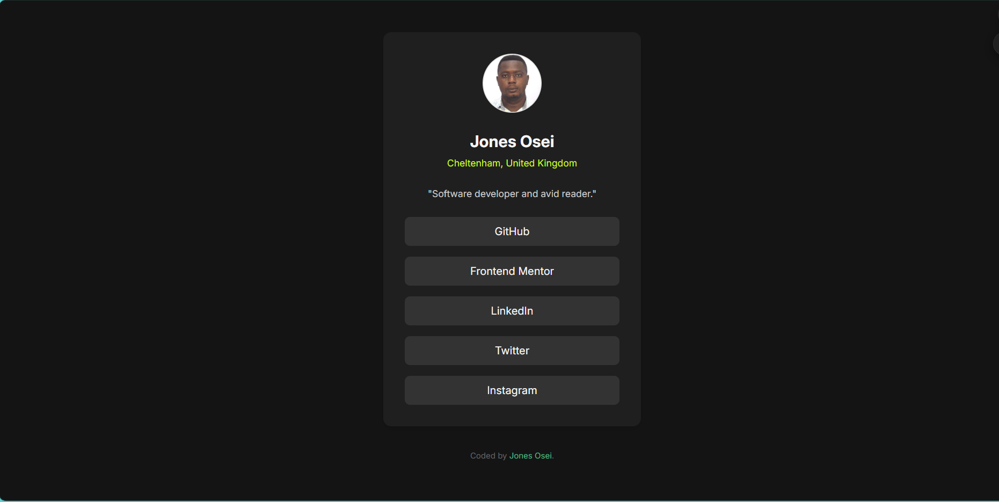
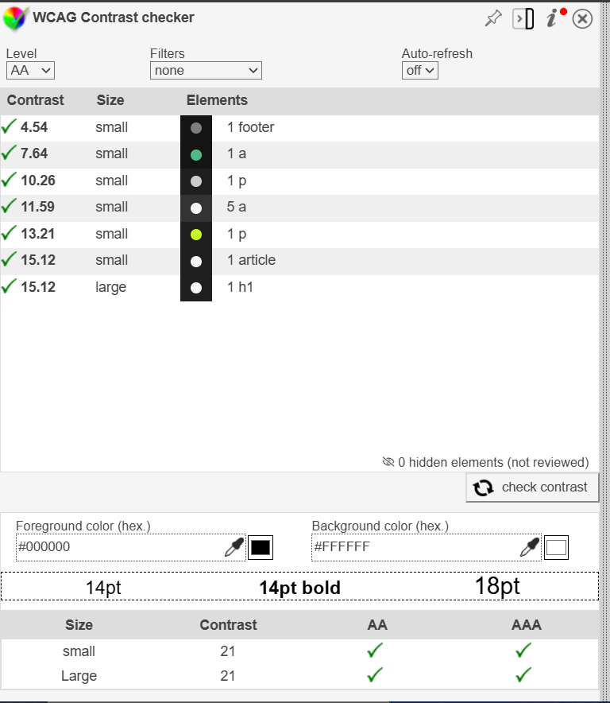

# Frontend Mentor - Social links profile solution

This is a solution to the [Social links profile challenge on Frontend Mentor](https://www.frontendmentor.io/challenges/social-links-profile-UG32l9m6dQ). Frontend Mentor challenges help you improve your coding skills by building realistic projects.

## Table of contents

- [Overview](#overview)
  - [The challenge](#the-challenge)
  - [Screenshot](#screenshot)
  - [Links](#links)
- [My process](#my-process)
  - [Built with](#built-with)
  - [What I learned](#what-i-learned)
  - [Continued development](#continued-development)
  - [Useful resources](#useful-resources)
- [Author](#author)
- [Acknowledgments](#acknowledgments)


## Overview

### The challenge

Users should be able to:

- See hover and focus states for all interactive elements on the page

### Screenshot




### WCAG Color Contrast



### Links

- Solution URL: [Add solution URL here](https://github.com/JonesKwameOsei/social-links-profile)
- Live Site URL: [Add live site URL here](https://joneskwameosei.github.io/social-links-profile/)

## My process

### Built with

- Semantic HTML5 markup
- CSS custom properties
- CSS Flexbox

### What I learned

I have understood how to create navigation links and use flexbox to style it. Also, I have learned to manipulate picture on a web page.

See below below of snippets of code:

```html
 <section>
      <article class="profile-header">
        
        <h1 class="name">Jones Osei</h1>
        <p class="location">Cheltenham, United Kingdom</p>
        <p class="bio">"Software developer and avid reader."</p>
      </article>
    </section>
```

```css
.card {
  background-color: hsl(0, 0%, 12%);
  border-radius: 12px;
  padding: 32px;
  max-width: 384px;
  width: 100%;
  text-align: center;
  box-shadow: 0 4px 6px rgba(0, 0, 0, 0.1);
}

.profile-img {
  width: 88px;
  height: auto;
  border-radius: 50%;
  margin-bottom: 24px;
  transition: transform 0.3s;
}

.profile-img:hover {
  transform: scale(1.1);
}
```

### Continued development

I will continue to explore the [Mozilla Developer Network](https://developer.mozilla.org/en-US/) docs to learn more.
